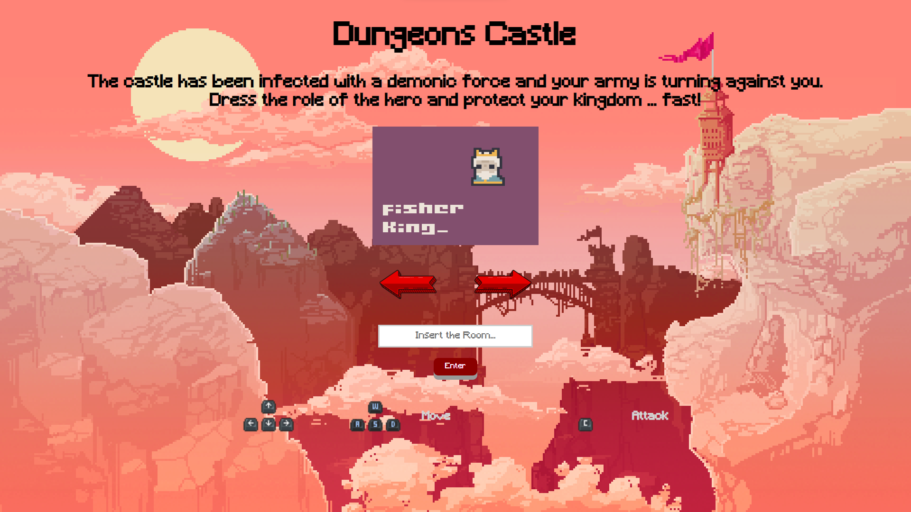
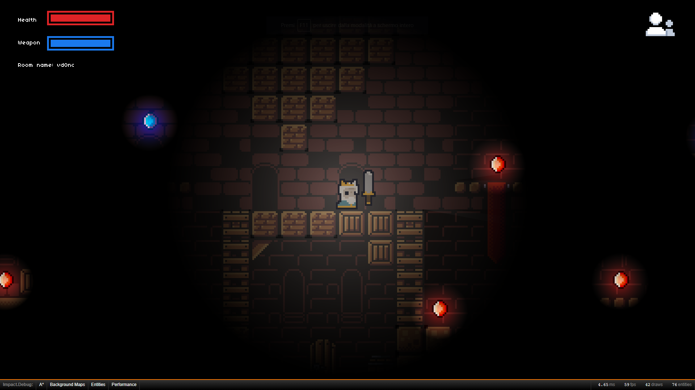

# Dungeon Castle

Multiplayer RPG video game based on WebRTC and [ImpactJS](https://impactjs.com/) for the Internet Technologies course of the University of Parma created by [Giorgio Coccapani]( https://github.com/GiorCocc ) (serial number 317280) and [Riccardo Mazza](https://github.com/sirMallet ) (serial number 321655).

## Index

- [Dungeon Castle](#dungeon-castle)
  - [Index](#index)
  - [Project structure](#project-structure)
  - [Structure of the game](#structure-of-the-game)
    - [Starting the game](#starting-the-game)
    - [The game](#the-game)
    - [Game commands](#game-commands)
    - [Adding new players](#adding-new-players)
  - [Installation](#installation)
  - [Implementation](#implementation)
    - [Signaling server](#signaling-server)
    - [Information exchanged between players](#information-exchanged-between-players)
  - [References and credits](#references-and-credits)

## Project structure

The project has the following structure:

```text
.
├── lib
│   ├── game
│   │   ├── abilities
│   │   │   ├── weaponDamage.js
│   │   ├── entities
│   │   │   ├── player.js
│   │   │   └── remote-player.js
│   │   │   └── weapon.js
│   │   │   └── remote-weapon.js
|   |   |   └── ...
│   │   ├── levels
│   │   │   ├── testR.js
│   │   │   └── ...
│   │   ├── ui
│   │   │   ├── healthBar.js
│   │   │   ├── usageBar.js
│   │   │   └── ...
│   │   ├── main.js
│   │   └── events.js
│   ├── impact
│   ├── plusplus
│   ├── weltmeister
│   ├── network
│   │   ├── peer-connection.js
│   │   ├── room-connection.js
│   │   └── ...
│   ├── messages.js
├── media
├── img
├── index.html
├── entry.html
└── ...
```

- ` lib `: folder containing all game resources (levels, entities, interface elements, etc.)
- `media`: folder containing all multimedia resources (images, sounds, etc.) used in the game
- ` img `: folder containing the images used on the site
- `index.html`: site's main `html` file

## Structure of the game

### Starting the game

The game is meant to be played in peer-to-peer mode. To be able to play in this mode you need to run (starting from the game folder) the following two commands defined in the ` package.json ` file:

```bash
npm run signaling
npm run http
```

where the first command starts the signaling server and the second the http server. In order to play in peer-to-peer mode both players must be connected under the same wifi network and connected to the ip address of the player who started the http server. To find out your ip address , you can use the command ` ipconfig ` on Windows or ` ifconfig ` on Linux.

### The game



When you start the game, the `index.html` page will open where you can choose your game character and name for your game room. Among the players that it is possible to impersonate we find:

- Arthur Pendragon
- Merlin
- King Fisher
- Lancelot
- Guinevere
- The Lady of the Lake

Once you open the game room you will appear with your player in a random position on the game map.



In the game map there are three types of items to collect:

- **Life**: Increases player's life
- **Sword**: Resets the number of sword uses by one
- **Bonus**: Increases the number of sword uses and player lives

> Objective of the game: Your castle has been attacked by a demonic force and your army is turning against you. Your goal is to rid the castle of demons and kill your army.

### Game commands

The game controls are as follows:

- `WASD` or `↑↓←→`: character movement
- `C`: sword attack

### Adding new players

Once the game room has been created, new players can be added to the game. To do this, simply enter the same room name or press the button at the top right which copies the site address with the page name already set. This address can be sent to other players who will then be able to join the game. Up to 5 players can be present in the same room.

Each remote player on the screen is represented by a soldier from your army (Lancelot, Gawain, and Mordred ) and it is impossible for the player to tell which remote player they are facing. Each player can attack and be attacked. When a player's life ends, he is respawned in a random location on the map and can continue playing.

## Installation

In order to install the game you need to install [Node.js](https://nodejs.org/en/) and [npm](https://www.npmjs.com/). Among the necessary packages for the game we find:

- [ImpactJS](https://impactjs.com/): game development environment that comes with all the basic libraries and an editor for creating levels and maps
- [plusplus](https://collinhover.github.io/impactplusplus/): set of additional libraries for ImpactJS that allow you to add new features to the game
- [socket.io]( https://socket.io/): library for real-time communication between client and server
- [http- server]( https://www.npmjs.com/package/http-server): http server for peer-to-peer mode

To start the game you need to run the following commands in two different terminals:

```bash
node signalling/server.js
http-server -c-1 . -p <port>
```

where instead of `<port>` the port on which you want to start the http server must be inserted. In order to play in peer-to-peer mode both players must be connected under the same wifi network and connected to the ip address of the player who started the http server. To find out your ip address , you can use the command ` ipconfig ` on Windows or ` ifconfig ` on Linux.

Within the `signaling /server.js` file it is possible to change the port on which you want to start the signaling server which by default is set to port 8034.

## Implementation

The game, to be played in peer-to-peer mode, requires a server that allows you to create the game rooms in which to place players. When a user wants to join a room to play:

- tells the server the name of the room you want to enter
- the server replies with the list of players present in the room
- if the number of players is less than the maximum capacity of the room, then the other players receive a message containing the data of the new peer

### Signaling server

Each of the users must know at least the address and port where his opponent is listening and is able to receive incoming data. To obtain this information, a signaling server is used. The procedure for exchanging data via signaling is as follows:

1. User A sends a connection request to user B;
2. User B confirms A's request;
3. After receiving the confirmation, user A identifies his IP, port, any session parameters and sends them to user B;
4. User B responds by sending his address, port, and session parameters to User A.

Once these operations are completed, both users know each other's address and parameters and can start exchanging data. In order to obtain the information relating to one's public address and port, a STUN server is used, such as that of [Google](https://gist.github.com/zziuni/3741933).

```javascript
iceServers: [{
    url: 'stun:stun.l.google.com:19302'
  }],
```

To set up, monitor and close a connection, you use RTCPeerConnection and its connection lifecycle callbacks . The parameters required for the connection are:

- ` icecandidate `: for processing found peer
- ` iceconnectionstatechange `: to monitor the connection status
- ` datachannel `: for processing the data channel offered by RTCDataChannel . RTCDataChannel offers a series of events that describe the lifecycle of a data channel. Of these `open`, `close` and ` message ` are needed to open and close a channel and receive a message

```javascript
this.dataChannelHandlers = {
      'open': this.onDataChannelOpen,
      'close': this.onDataChannelClose,
      'message': this.onDataChannelMessage
    };
```

`createOffer` method offered by RTCPeerConnection is used to share the session parameters between the peers, and the ` createAnswer ` method to create the response. These methods are used within the lifecycle of the connection and are required for proper communication between peers to work.

The operations that are performed to identify the session parameters are as follows:

1. Peer A creates an SDP offer with a description of the local session and sends it to Peer B via a communication channel.

    ```javascript
    connect: function() {
        // ...
        if (this.isInitiator) {
          this.setLocalDescriptionAndSend();
        }
      },
    
    setLocalDescriptionAndSend: function() {
        var self = this;
        self.getDescription()
          .then(function(localDescription) {
            self.peerConnection.setLocalDescription(localDescription)
              .then(function() {
                self.log('Sending SDP', 'green');
                self.sendSdp(self.peerUser.userId, localDescription);
              });
          })
          .catch(function(error) {
            self.log('onSdpError: ' + error.message, 'red');
          });
      },
    
    getDescription: function() {
        return this.isInitiator ?
          this.peerConnection.createOffer() :
          this.peerConnection.createAnswer();
      },
    ```

2. Client B receives the offer from client A and sets up a description of the remote session, which represents the response to the received offer.

    ```javascript
    setSdp: function(sdp) {
        var self = this;
        // Create session description from sdp data
        var rsd = new RTCSessionDescription(sdp);
        // And set it as remote description for peer connection
        self.peerConnection.setRemoteDescription(rsd)
          .then(function() {
            self.remoteDescriptionReady = true;
            self.log('Got SDP from remote peer', 'green');
            // Add all received remote candidates
            while (self.pendingCandidates.length) {
              self.addRemoteCandidate(self.pendingCandidates.pop());
            }
            // Got offer? send answer
            if (!self.isInitiator) {
              self.setLocalDescriptionAndSend();
            }
          });
      },
    ```

3. Once both peers have set their session descriptions, the connection is established and the peers can start exchanging data.

    ```javascript
    onLocalIceCandidate: function(event) {
        if (event.candidate) {
          this.log('Send my ICE-candidate: ' + event.candidate.candidate, 'gray');
          this.sendIceCandidate(this.peerUser.userId, event.candidate);
        } else {
          this.log('No more candidates', 'gray');
        }
      },
    ```

The information that is exchanged between the peers in the room is as follows:

``` javascript
  Another player joined. id = 2
  [Peer-2, have-remote-offer] Got SDP from remote peer
  [Peer-2, stable] Sending SDP
  [Peer-2, stable] Send my ICE-candidate: candidate:3352083459 1 udp 2113937151 2dc58a58-f3ff-490d-986b-cb3aee17f591.local 60083 typ host generation 0 ufrag qwsh network-cost 999
  [Peer-2, stable] Added his ICE-candidate:candidate:4047144073 1 udp 2113937151 a29cc1f6-6be4-4613-8178-0808e7f03199.local 60001 typ host generation 0 ufrag B6yE network-cost 999
  [Peer-2, stable] Connection state: checking
  [Peer-2, stable] No more candidates
  [Peer-2, stable] Connection state: connected
```

where `candidate` is a unique code assigned to the remote peer and ` typ ` is the type of connection being used. In this case, the connection type is `host` , which indicates that the remote peer is connected to the same network as the local peer. This is the simplest case, where the peers are connected to the same network and you don't need to use a TURN server to establish the connection. Otherwise, the connection type will be ` srflx ` or ` relay `, which indicates that the remote peer is connected to a different network and that a TURN server must be used to establish the connection. The ` udp ` entry indicates that the UDP protocol is used for communication between peers and information exchange.

### Information exchanged between players

Each player present in the room communicates a set of basic information:

- player position
- player speed
- direction of movement

```javascript
  broadcastState: function () {
    this.connection.broadcastMessage(MessageBuilder.createMessage(MESSAGE_STATE)
     .setX(this.getPlayer().pos.x)
     .setY(this.getPlayer().pos.y)
     .setVelX((this.getPlayer().pos.x - this.getPlayer().last.x))
     .setVelY((this.getPlayer().pos.y - this.getPlayer().last.y))
     .setFlip(this.getPlayer().dx < 0 ? -1 : 1)
    );
   },
```

The information sent by the remote player must be received instantly by the local player. However, this is practically impossible due to the speed and stability of the connection and the possible latency of the system. As a result, the information sent by the remote player is interpolated by the local player to predict the remote player's movement. This information interpolation technique is essential to ensure smooth gameplay and a stable connection between players.

```javascript
  setState: function (state) {
        var x = state.getX();
        var y = state.getY();

        this.dx = state.getVelX(); //x - this.pos.x;
        this.dy = state.getVelY(); //y - this.pos.y;

        this.pos = { x: x, y: y };

        this.stateUpdated = true;
      },

      update: function () {
        this.parent();
    
    if (this.stateUpdated) {
          this.stateUpdated = false;
        } else {
          this.pos.x += this.dx;
          this.pos.y += this.dy;

          if (this.currentAnim) {
            this.currentAnim.update();
          }
        }

        if(this.dx > 0){
          this.flip.x = false;
        } else if(this.dx < 0){
          this.flip.x = true;
        }
```

This method helps to reduce the negative effects of the connection, since the location processing is done locally. However, this doesn't solve the problem when the connection is particularly slow. There are several workarounds that can be adopted in these cases, such as using compression algorithms to reduce the amount of data transmitted or implementing a local cache to reduce the number of location requests sent to the server. Additionally, it might be worth considering using caching techniques to store the most frequently requested location information in order to reduce response times. Finally, it is important to remember that choosing the best solution depends on the specific requirements of the application and the needs of the users.

## References and credits

We thank [rottingpixels](https://rottingpixels.itch.io/) for making available for use the [set of images]( https://rottingpixels.itch.io/castle-platformer-tileset-16x16free) used for the making of the map and [analogstudios](https://analogstudios.itch.io/) for the [game players and weapons](https://analogstudios.itch.io/camelot).

Music made by [Riccardo Mazza](https://github.com/sirMallet ) with [boscaceoil](https://boscaceoil.net/).
