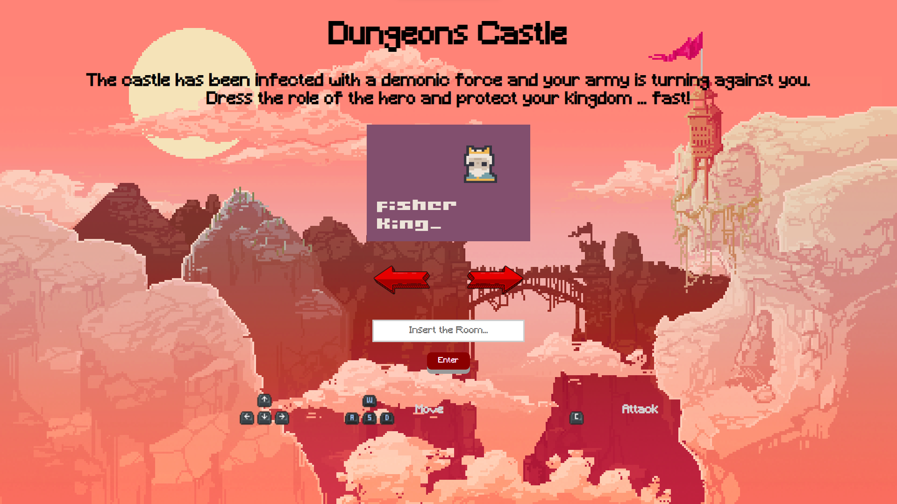
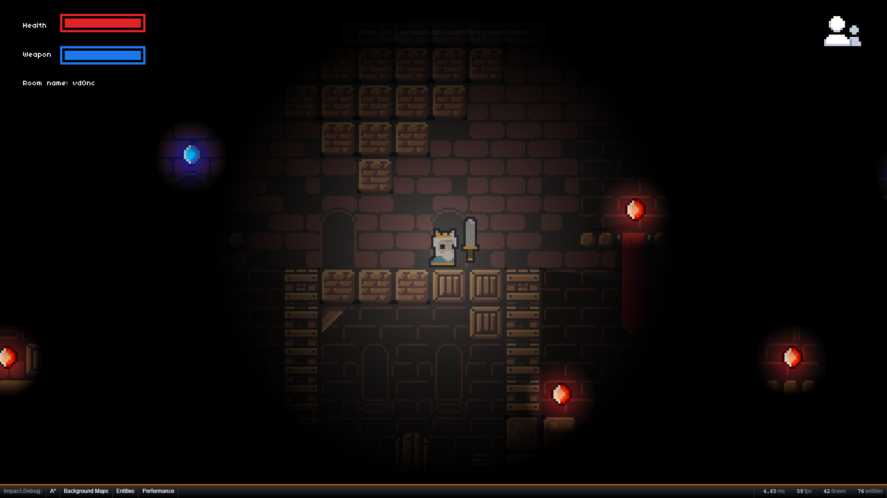

# Dungeon Castle

Multiplayer RPG video game based on WebRTC and [ImpactJS](https://impactjs.com/) for the Internet Technologies course of the University of Parma created by [Giorgio Coccapani]( https://github.com/GiorCocc ) (serial number 317280) and [Riccardo Mazza](https://github.com/sirMallet ) (serial number 321655).

## Features

- **Real-time Multiplayer**: Support for up to 5 players in the same game room
- **Peer-to-Peer Networking**: Direct communication between players using WebRTC technology
- **Multiple Character Classes**: Choose from 6 different characters including Arthur Pendragon, Merlin, King Fisher, Lancelot, Guinevere, and The Lady of the Lake
- **Dynamic Gameplay**: Collect items, engage in combat, and explore a medieval castle environment
- **Cross-Platform Compatibility**: Runs in any modern web browser with WebRTC support
- **Room-based Matchmaking**: Create or join game rooms with custom names
- **Real-time State Synchronization**: Player positions, movements, and actions are synchronized across all clients
- **Item Collection System**: Three types of collectible items (Life, Sword, Bonus) with different effects
- **Combat System**: Sword-based combat with usage limits and regeneration mechanics
- **Respawn System**: Automatic respawning after player death with random positioning

## Index

- [Dungeon Castle](#dungeon-castle)
  - [Index](#index)
  - [Features](#features)
  - [System Requirements](#system-requirements)
  - [Technologies Used](#technologies-used)
  - [Project structure](#project-structure)
  - [Installation](#installation)
    - [Prerequisites](#prerequisites)
    - [Step-by-step Installation](#step-by-step-installation)
    - [Development Setup](#development-setup)
  - [Structure of the game](#structure-of-the-game)
    - [Starting the game](#starting-the-game)
    - [The game](#the-game)
    - [Game commands](#game-commands)
    - [Adding new players](#adding-new-players)
  - [Technical Architecture](#technical-architecture)
    - [Signaling server](#signaling-server)
    - [Information exchanged between players](#information-exchanged-between-players)
    - [Game Engine Architecture](#game-engine-architecture)
    - [Networking Architecture](#networking-architecture)
  - [Troubleshooting](#troubleshooting)
  - [Known Issues and Limitations](#known-issues-and-limitations)
  - [Contributing](#contributing)
  - [License](#license)
  - [References and credits](#references-and-credits)

## System Requirements

### Minimum Requirements

- **Operating System**: Windows 10, macOS 10.14, or Ubuntu 18.04 (or equivalent Linux distribution)
- **Node.js**: Version 12.0 or higher
- **npm**: Version 6.0 or higher (usually comes with Node.js)
- **Web Browser**: 
  - Chrome 60+ (recommended)
  - Firefox 55+
  - Safari 11+
  - Edge 79+
- **RAM**: At least 4GB (8GB recommended for development)
- **Network**: Stable internet connection for signaling server, WiFi network for local P2P gameplay

### Browser Requirements

The game requires a modern web browser with support for:
- **WebRTC**: For peer-to-peer communication
- **WebAudio API**: For game sounds and music
- **Canvas API**: For game rendering
- **WebSockets**: For signaling server communication
- **ES6 Features**: Arrow functions, promises, and modern JavaScript syntax

### Development Requirements

For development and contributing to the project:
- **Git**: For version control
- **Code Editor**: VS Code, WebStorm, or similar with JavaScript support
- **Browser Developer Tools**: For debugging and testing

## Technologies Used

This project leverages several key technologies and libraries:

### Core Technologies
- **[Node.js](https://nodejs.org/)**: Server-side JavaScript runtime for the signaling server
- **[WebRTC](https://webrtc.org/)**: Real-time peer-to-peer communication protocol
- **HTML5 Canvas**: For game rendering and graphics
- **JavaScript ES6+**: Modern JavaScript features and syntax

### Game Engine and Libraries
- **[ImpactJS](https://impactjs.com/)**: 2D game engine for HTML5 canvas
- **[Impact++](https://collinhover.github.io/impactplusplus/)**: Extended library for ImpactJS with additional features and improvements
- **Weltmeister**: Level editor included with ImpactJS for creating game maps

### Networking Libraries
- **[Socket.io](https://socket.io/)**: Real-time bidirectional event-based communication for the signaling server
- **[http-server](https://www.npmjs.com/package/http-server)**: Simple HTTP server for serving the game files

### Development Tools
- **npm**: Package manager for Node.js dependencies
- **Git**: Version control system

### Browser APIs Used
- **WebRTC RTCPeerConnection**: For establishing P2P connections
- **WebRTC RTCDataChannel**: For sending game data between peers
- **WebAudio API**: For game sound effects and music
- **Canvas 2D API**: For game graphics rendering
- **WebSocket API**: For signaling server communication

## Project structure

The project has the following structure:

```text
.
├── lib/                          # Core game libraries and modules
│   ├── game/                     # Game-specific code and logic
│   │   ├── abilities/            # Game abilities and special powers
│   │   │   └── weaponDamage.js   # Weapon damage calculation system
│   │   ├── entities/             # Game entities (players, items, weapons)
│   │   │   ├── player.js         # Main player entity and logic
│   │   │   ├── remote-player.js  # Remote player representation and synchronization
│   │   │   ├── weapon.js         # Local player weapon entity
│   │   │   ├── remote-weapon.js  # Remote player weapon synchronization
│   │   │   ├── damage.js         # Damage system and effects
│   │   │   ├── item-blue.js      # Life restoration items
│   │   │   ├── item-red.js       # Sword usage restoration items
│   │   │   └── item-yellow.js    # Bonus items (life + sword usage)
│   │   ├── levels/               # Game levels and maps
│   │   │   ├── testR.js          # Main game level definition
│   │   │   └── ...               # Additional level files
│   │   ├── ui/                   # User interface components
│   │   │   ├── healthBar.js      # Player health display
│   │   │   ├── usageBar.js       # Weapon usage counter display
│   │   │   ├── copyUrlButton.js  # Share game room URL functionality
│   │   │   ├── informations.js   # Game information displays
│   │   │   └── label.js          # Text label UI component
│   │   ├── main.js               # Main game initialization and loop
│   │   └── events.js             # Game event handling system
│   ├── impact/                   # ImpactJS game engine core files
│   │   ├── game.js               # Core game class and functionality
│   │   ├── entity.js             # Base entity class
│   │   ├── system.js             # System and platform abstraction
│   │   ├── loader.js             # Asset loading system
│   │   ├── input.js              # Input handling (keyboard, mouse)
│   │   ├── sound.js              # Audio system
│   │   ├── timer.js              # Game timing and animation
│   │   └── ...                   # Additional core engine files
│   ├── plusplus/                 # Impact++ extension library
│   │   └── ...                   # Extended features and improvements
│   ├── weltmeister/              # Level editor for creating game maps
│   │   └── ...                   # Map editing tools and interface
│   ├── network/                  # Networking and P2P communication
│   │   ├── peer-connection.js    # WebRTC peer connection management
│   │   ├── room-connection.js    # Game room connection handling
│   │   └── socket.io.js          # Socket.io client library
│   └── messages.js               # Message types and communication protocols
├── media/                        # Game assets and multimedia resources
│   ├── sprites/                  # Character and entity sprite sheets
│   ├── tiles/                    # Environment and terrain tiles
│   ├── weapons/                  # Weapon graphics and animations
│   ├── *.png                     # Image files (sprites, tiles, UI elements)
│   ├── *.ogg                     # Audio files (music and sound effects)
│   └── *.font.png                # Bitmap fonts for game text
├── img/                          # Website and documentation images
│   ├── index.png                 # Main menu screenshot
│   ├── gameScreen.png            # Gameplay screenshot
│   └── ...                       # Additional screenshots and graphics
├── signalling/                   # WebRTC signaling server
│   └── server.js                 # Node.js signaling server implementation
├── index.html                    # Character selection and room creation page
├── entry.html                    # Main game canvas and gameplay page
├── weltmeister.html              # Level editor interface
├── package.json                  # Node.js dependencies and scripts
├── package-lock.json             # Locked dependency versions
├── favicon.ico                   # Website favicon
├── .gitignore                    # Git ignore patterns
└── README.md                     # Project documentation (this file)
```

### Key Directories Explained

- **`lib/`**: Contains all game libraries and modules
  - **`game/`**: Game-specific logic including entities, UI components, and level definitions
  - **`impact/`**: Core ImpactJS game engine providing fundamental game functionality
  - **`plusplus/`**: Extended features and improvements over base ImpactJS
  - **`network/`**: WebRTC and networking implementation for multiplayer functionality
  - **`weltmeister/`**: Built-in level editor for creating and modifying game maps

- **`media/`**: All multimedia assets including sprites, sounds, textures, and fonts

- **`signalling/`**: Backend signaling server for WebRTC peer discovery and connection establishment

- **`*.html`**: Frontend pages for different aspects of the game (menu, gameplay, level editing)

## Structure of the game

### Starting the game

The game is meant to be played in peer-to-peer mode. To be able to play in this mode you need to run (starting from the game folder) the following two commands defined in the ` package.json ` file:

```bash
npm run signaling
npm run http
```

where the first command starts the signaling server and the second the http server. In order to play in peer-to-peer mode both players must be connected under the same wifi network and connected to the ip address of the player who started the http server. To find out your ip address , you can use the command ` ipconfig ` on Windows or ` ifconfig ` on Linux.

### The game



When you start the game, the `index.html` page will open where you can choose your game character and name for your game room. Among the players that it is possible to impersonate we find:

- Arthur Pendragon
- Merlin
- King Fisher
- Lancelot
- Guinevere
- The Lady of the Lake

Once you open the game room you will appear with your player in a random position on the game map.



In the game map there are three types of items to collect:

- **Life**: Increases player's life
- **Sword**: Resets the number of sword uses by one
- **Bonus**: Increases the number of sword uses and player lives

> Objective of the game: Your castle has been attacked by a demonic force and your army is turning against you. Your goal is to rid the castle of demons and kill your army.

### Game commands

The game controls are as follows:

- `WASD` or `↑↓←→`: character movement
- `C`: sword attack

### Adding new players

Once the game room has been created, new players can be added to the game. To do this, simply enter the same room name or press the button at the top right which copies the site address with the page name already set. This address can be sent to other players who will then be able to join the game. Up to 5 players can be present in the same room.

Each remote player on the screen is represented by a soldier from your army (Lancelot, Gawain, and Mordred ) and it is impossible for the player to tell which remote player they are facing. Each player can attack and be attacked. When a player's life ends, he is respawned in a random location on the map and can continue playing.

## Installation

### Prerequisites

Before installing and running Dungeon Castle, ensure you have the following software installed on your system:

#### 1. Node.js and npm

**Windows:**
1. Download Node.js from [nodejs.org](https://nodejs.org/)
2. Run the installer and follow the setup wizard
3. Verify installation by opening Command Prompt and running:
   ```cmd
   node --version
   npm --version
   ```

**macOS:**
1. Download Node.js from [nodejs.org](https://nodejs.org/) or install via Homebrew:
   ```bash
   brew install node
   ```
2. Verify installation:
   ```bash
   node --version
   npm --version
   ```

**Linux (Ubuntu/Debian):**
```bash
# Update package index
sudo apt update

# Install Node.js and npm
sudo apt install nodejs npm

# Verify installation
node --version
npm --version
```

#### 2. Git (Optional but recommended for development)

**Windows:** Download from [git-scm.com](https://git-scm.com/)

**macOS:** 
```bash
brew install git
```

**Linux:**
```bash
sudo apt install git
```

### Step-by-step Installation

#### Option 1: Download and Run (Recommended for Players)

1. **Download the project:**
   - Download the ZIP file from the GitHub repository
   - Extract it to your desired location

2. **Navigate to the project directory:**
   ```bash
   cd ProgettoTecnologieInternet
   ```

3. **Install dependencies:**
   ```bash
   npm install
   ```

4. **Start the game servers:**
   
   **Option A: Using npm scripts (Recommended)**
   ```bash
   # In first terminal - Start signaling server
   npm run signalling
   
   # In second terminal - Start HTTP server
   npm run http
   ```
   
   **Option B: Manual startup**
   ```bash
   # In first terminal - Start signaling server
   node signalling/server.js
   
   # In second terminal - Start HTTP server on port 8080
   npx http-server -c-1 . -p 8080
   ```

5. **Access the game:**
   - Open your web browser
   - Go to `http://localhost:8080`
   - For local network play, use your IP address instead of localhost

#### Option 2: Clone from Git (Recommended for Developers)

1. **Clone the repository:**
   ```bash
   git clone https://github.com/GiorCocc/ProgettoTecnologieInternet.git
   cd ProgettoTecnologieInternet
   ```

2. **Install dependencies:**
   ```bash
   npm install
   ```

3. **Follow steps 4-5 from Option 1**

### Development Setup

For developers who want to modify or contribute to the game:

#### 1. Development Environment Setup

1. **Install a code editor** (recommended):
   - [Visual Studio Code](https://code.visualstudio.com/)
   - [WebStorm](https://www.jetbrains.com/webstorm/)
   - [Sublime Text](https://www.sublimetext.com/)

2. **Install useful VS Code extensions** (if using VS Code):
   - JavaScript (ES6) code snippets
   - HTML CSS Support
   - Live Server
   - GitLens

#### 2. Development Workflow

1. **Start development servers:**
   ```bash
   # Terminal 1: Signaling server with auto-restart
   npm run signalling
   
   # Terminal 2: HTTP server
   npm run http
   ```

2. **Access the level editor:**
   - Navigate to `http://localhost:8080/weltmeister.html`
   - Create and modify game levels using the built-in editor

3. **Development tips:**
   - Use browser developer tools for debugging
   - Check the browser console for WebRTC connection logs
   - Monitor network traffic in the Network tab
   - Use the Sources tab for JavaScript debugging

#### 3. Custom Configuration

**Signaling Server Port Configuration:**
Edit `signalling/server.js` to change the default port (8034):
```javascript
var PORT = 8034; // Change this to your desired port
```

**HTTP Server Port Configuration:**
Modify the npm script in `package.json` or run manually:
```bash
npx http-server -c-1 . -p YOUR_PORT
```

**Maximum Room Users:**
Edit `signalling/server.js` to change the player limit:
```javascript
var MAX_ROOM_USERS = 5; // Change this to your desired limit
```

### Network Configuration for Multiplayer

#### Local Network Play (Same WiFi)

1. **Find your IP address:**
   
   **Windows:**
   ```cmd
   ipconfig
   ```
   Look for "IPv4 Address" under your active network adapter
   
   **macOS/Linux:**
   ```bash
   ifconfig
   ```
   Look for "inet" address under your active network interface

2. **Share your game:**
   - Start both servers on your machine
   - Share your IP address with other players
   - Other players access: `http://YOUR_IP:8080`
   - All players must be on the same WiFi network

#### Firewall Configuration

Ensure the following ports are open in your firewall:
- **Port 8034**: Signaling server (WebSocket connections)
- **Port 8080**: HTTP server (or your chosen port)
- **Random UDP ports**: WebRTC data channels (automatically handled by most firewalls)

### Troubleshooting Installation

**Common Issues:**

1. **Node.js/npm not found:**
   - Ensure Node.js is properly installed and added to PATH
   - Restart your terminal/command prompt after installation

2. **Port already in use:**
   ```bash
   # Find process using the port (Linux/macOS)
   lsof -i :8080
   
   # Kill the process or choose a different port
   npm run http -- -p 3000
   ```

3. **npm install fails:**
   ```bash
   # Clear npm cache
   npm cache clean --force
   
   # Delete node_modules and reinstall
   rm -rf node_modules package-lock.json
   npm install
   ```

4. **WebRTC connection issues:**
   - Ensure both players are on the same network
   - Check that firewall allows the applications
   - Try disabling antivirus temporarily for testing
   - Use Chrome for best WebRTC compatibility

## Technical Architecture

Dungeon Castle implements a hybrid architecture combining client-server signaling with peer-to-peer data exchange. This design provides the benefits of decentralized gameplay while maintaining centralized room management.

### Architecture Overview

```
┌─────────────────┐    ┌─────────────────┐    ┌─────────────────┐
│     Player 1    │    │  Signaling      │    │     Player 2    │
│   (Web Client)  │    │   Server        │    │   (Web Client)  │
│                 │    │  (Node.js +     │    │                 │
│                 │    │   Socket.io)    │    │                 │
└─────────────────┘    └─────────────────┘    └─────────────────┘
         │                       │                       │
         │ 1. Join Room Request  │                       │
         ├──────────────────────▶│                       │
         │                       │ 2. Join Room Request  │
         │                       │◀──────────────────────┤
         │ 3. Peer Info Exchange │                       │
         │◀─────────────────────▶│◀─────────────────────▶│
         │                       │                       │
         │ 4. Direct P2P Connection (WebRTC)             │
         │◀─────────────────────────────────────────────▶│
         │                       │                       │
         │ 5. Game Data Exchange │                       │
         │◀─────────────────────────────────────────────▶│
```

### Room Management System

The game implements a room-based matchmaking system where:

1. **Room Creation**: Players create or join named rooms through the signaling server
2. **Capacity Control**: Each room supports up to 5 concurrent players (configurable)
3. **Peer Discovery**: The signaling server facilitates initial peer discovery and connection establishment
4. **Dynamic Membership**: Players can join and leave rooms dynamically without disrupting other players

**Room Lifecycle:**
```javascript
// Room creation and user management flow
function onJoin(joinData) {
    // Get existing room or create new one
    room = getOrCreateRoom(joinData.roomName);
    
    // Validate room capacity
    if (room.numUsers() >= MAX_ROOM_USERS) {
        // Reject connection if room is full
        return sendError(MessageType.ERROR_ROOM_IS_FULL);
    }
    
    // Add user to room and notify others
    room.addUser(user = new User(), socket);
    room.broadcastMessageFromUser(user, MessageType.USER_JOIN, {
        userId: user.getId(),
        users: room.getUsers()
    });
}
```

### Signaling Server

The signaling server acts as a facilitator for WebRTC peer connections. It's built on Node.js with Socket.io for real-time communication and manages room creation, peer discovery, and connection bootstrapping.

#### Server Architecture

**Key Components:**
- **Room Manager**: Handles room creation, user management, and capacity control
- **Message Router**: Routes SDP offers/answers and ICE candidates between peers
- **Connection Handler**: Manages WebSocket connections and cleanup

**Message Types:**
```javascript
var MessageType = {
    // Room management
    JOIN: 'join',                    // Join room request
    ROOM: 'room',                    // Room information
    USER_JOIN: 'user_join',          // New user notification
    USER_LEAVE: 'user_leave',        // User departure notification
    
    // WebRTC signaling
    SDP: 'sdp',                      // Session Description Protocol
    ICE_CANDIDATE: 'ice_candidate',  // ICE candidate exchange
    
    // Error handling
    ERROR_ROOM_IS_FULL: 'error_room_is_full',
    ERROR_USER_INITIALIZED: 'error_user_initialized'
};
```

#### WebRTC Connection Establishment Process

Each of the users must know at least the address and port where his opponent is listening and is able to receive incoming data. To obtain this information, a signaling server is used. The procedure for exchanging data via signaling is as follows:

1. User A sends a connection request to user B;
2. User B confirms A's request;
3. After receiving the confirmation, user A identifies his IP, port, any session parameters and sends them to user B;
4. User B responds by sending his address, port, and session parameters to User A.

Once these operations are completed, both users know each other's address and parameters and can start exchanging data. In order to obtain the information relating to one's public address and port, a STUN server is used, such as that of [Google](https://gist.github.com/zziuni/3741933).

#### STUN/TURN Server Configuration

The game uses Google's public STUN server for NAT traversal:

```javascript
var peerConnectionConfig = {
    iceServers: [{
        url: 'stun:stun.l.google.com:19302'
    }]
};
```

**STUN Server Functions:**
- **Public IP Discovery**: Helps clients discover their public IP address
- **NAT Type Detection**: Determines the type of NAT the client is behind
- **Port Mapping**: Assists in creating port mappings for incoming connections

**Connection Types:**
- **`host`**: Direct connection (same network) - fastest and most reliable
- **`srflx`**: Server reflexive (through NAT) - requires STUN server
- **`relay`**: Relayed connection (through TURN server) - fallback for restrictive networks

To set up, monitor and close a connection, you use RTCPeerConnection and its connection lifecycle callbacks . The parameters required for the connection are:

- ` icecandidate `: for processing found peer
- ` iceconnectionstatechange `: to monitor the connection status
- ` datachannel `: for processing the data channel offered by RTCDataChannel . RTCDataChannel offers a series of events that describe the lifecycle of a data channel. Of these `open`, `close` and ` message ` are needed to open and close a channel and receive a message

```javascript
this.dataChannelHandlers = {
      'open': this.onDataChannelOpen,
      'close': this.onDataChannelClose,
      'message': this.onDataChannelMessage
    };
```

`createOffer` method offered by RTCPeerConnection is used to share the session parameters between the peers, and the ` createAnswer ` method to create the response. These methods are used within the lifecycle of the connection and are required for proper communication between peers to work.

The operations that are performed to identify the session parameters are as follows:

1. Peer A creates an SDP offer with a description of the local session and sends it to Peer B via a communication channel.

    ```javascript
    connect: function() {
        // ...
        if (this.isInitiator) {
          this.setLocalDescriptionAndSend();
        }
      },
    
    setLocalDescriptionAndSend: function() {
        var self = this;
        self.getDescription()
          .then(function(localDescription) {
            self.peerConnection.setLocalDescription(localDescription)
              .then(function() {
                self.log('Sending SDP', 'green');
                self.sendSdp(self.peerUser.userId, localDescription);
              });
          })
          .catch(function(error) {
            self.log('onSdpError: ' + error.message, 'red');
          });
      },
    
    getDescription: function() {
        return this.isInitiator ?
          this.peerConnection.createOffer() :
          this.peerConnection.createAnswer();
      },
    ```

2. Client B receives the offer from client A and sets up a description of the remote session, which represents the response to the received offer.

    ```javascript
    setSdp: function(sdp) {
        var self = this;
        // Create session description from sdp data
        var rsd = new RTCSessionDescription(sdp);
        // And set it as remote description for peer connection
        self.peerConnection.setRemoteDescription(rsd)
          .then(function() {
            self.remoteDescriptionReady = true;
            self.log('Got SDP from remote peer', 'green');
            // Add all received remote candidates
            while (self.pendingCandidates.length) {
              self.addRemoteCandidate(self.pendingCandidates.pop());
            }
            // Got offer? send answer
            if (!self.isInitiator) {
              self.setLocalDescriptionAndSend();
            }
          });
      },
    ```

3. Once both peers have set their session descriptions, the connection is established and the peers can start exchanging data.

    ```javascript
    onLocalIceCandidate: function(event) {
        if (event.candidate) {
          this.log('Send my ICE-candidate: ' + event.candidate.candidate, 'gray');
          this.sendIceCandidate(this.peerUser.userId, event.candidate);
        } else {
          this.log('No more candidates', 'gray');
        }
      },
    ```

#### Connection Establishment Logs

The information that is exchanged between the peers in the room is as follows:

``` javascript
  Another player joined. id = 2
  [Peer-2, have-remote-offer] Got SDP from remote peer
  [Peer-2, stable] Sending SDP
  [Peer-2, stable] Send my ICE-candidate: candidate:3352083459 1 udp 2113937151 2dc58a58-f3ff-490d-986b-cb3aee17f591.local 60083 typ host generation 0 ufrag qwsh network-cost 999
  [Peer-2, stable] Added his ICE-candidate:candidate:4047144073 1 udp 2113937151 a29cc1f6-6be4-4613-8178-0808e7f03199.local 60001 typ host generation 0 ufrag B6yE network-cost 999
  [Peer-2, stable] Connection state: checking
  [Peer-2, stable] No more candidates
  [Peer-2, stable] Connection state: connected
```

where `candidate` is a unique code assigned to the remote peer and ` typ ` is the type of connection being used. In this case, the connection type is `host` , which indicates that the remote peer is connected to the same network as the local peer. This is the simplest case, where the peers are connected to the same network and you don't need to use a TURN server to establish the connection. Otherwise, the connection type will be ` srflx ` or ` relay `, which indicates that the remote peer is connected to a different network and that a TURN server must be used to establish the connection. The ` udp ` entry indicates that the UDP protocol is used for communication between peers and information exchange.

### Information exchanged between players

The game implements a real-time state synchronization system where each player broadcasts their game state to all connected peers. This approach ensures that all players maintain a consistent view of the game world while minimizing latency through direct P2P communication.

#### Message Types and Protocol

The game uses a structured messaging system with predefined message types:

```javascript
// Message type constants
var MESSAGE_STATE = 0;          // Player position and movement
var MESSAGE_DIED = 2;           // Player death notification
var MESSAGE_ATTACK = 3;         // Attack action
var MESSAGE_COLLECT_ITEM = 4;   // Item collection
var MESSAGE_FRAG_COUNT = 5;     // Kill count update
```

#### Player State Broadcasting

Each player continuously broadcasts their current state to maintain synchronization:

```javascript
broadcastState: function () {
    this.connection.broadcastMessage(MessageBuilder.createMessage(MESSAGE_STATE)
        .setX(this.getPlayer().pos.x)              // Current X position
        .setY(this.getPlayer().pos.y)              // Current Y position
        .setVelX((this.getPlayer().pos.x - this.getPlayer().last.x))  // X velocity
        .setVelY((this.getPlayer().pos.y - this.getPlayer().last.y))  // Y velocity
        .setFlip(this.getPlayer().dx < 0 ? -1 : 1) // Sprite direction
    );
}
```

**State Information Includes:**
- **Position Data**: Exact X,Y coordinates on the game map
- **Velocity Vectors**: Movement speed and direction for interpolation
- **Visual State**: Character orientation (left/right facing)
- **Animation State**: Current animation frame and state
- **Health Status**: Current health points and status effects

#### Network Interpolation and Prediction

The game implements client-side prediction and interpolation to handle network latency and ensure smooth gameplay:

```javascript
setState: function (state) {
    var x = state.getX();
    var y = state.getY();

    // Store velocity for interpolation
    this.dx = state.getVelX();
    this.dy = state.getVelY();

    // Update position from remote state
    this.pos = { x: x, y: y };
    this.stateUpdated = true;
},

update: function () {
    this.parent();

    if (this.stateUpdated) {
        // Use exact position from network update
        this.stateUpdated = false;
    } else {
        // Interpolate position based on last known velocity
        this.pos.x += this.dx;
        this.pos.y += this.dy;

        if (this.currentAnim) {
            this.currentAnim.update();
        }
    }

    // Update sprite orientation based on movement
    if(this.dx > 0){
        this.flip.x = false;  // Face right
    } else if(this.dx < 0){
        this.flip.x = true;   // Face left
    }
}
```

#### Latency Compensation Techniques

**1. Client-Side Prediction:**
- Local player actions are immediately applied without waiting for network confirmation
- Smooth movement is maintained even during network hiccups
- Position corrections are applied gradually to avoid jarring jumps

**2. Interpolation:**
- Remote player positions are interpolated between known states
- Velocity vectors are used to predict movement between updates
- Animation frames are synchronized with movement direction

**3. State Reconciliation:**
- Local predictions are reconciled with authoritative server state
- Conflicting states are resolved through interpolation rather than hard corrections

#### Network Optimization

**Message Frequency:**
- Player state updates are sent at 60fps during active movement
- Update frequency is reduced during idle periods to conserve bandwidth
- Only changed state properties are transmitted to minimize data usage

**Data Compression:**
- Position data is quantized to reduce precision where unnecessary
- Velocity vectors are calculated on the fly rather than stored
- Binary message format reduces overhead compared to JSON

**Connection Quality Adaptation:**
- Update frequency automatically adjusts based on measured latency
- Interpolation window size adapts to connection stability
- Fallback mechanisms handle temporary disconnections

This method helps to reduce the negative effects of the connection, since the location processing is done locally. However, this doesn't solve the problem when the connection is particularly slow. There are several workarounds that can be adopted in these cases, such as using compression algorithms to reduce the amount of data transmitted or implementing a local cache to reduce the number of location requests sent to the server. Additionally, it might be worth considering using caching techniques to store the most frequently requested location information in order to reduce response times. Finally, it is important to remember that choosing the best solution depends on the specific requirements of the application and the needs of the users.

### Game Engine Architecture

Dungeon Castle is built on the ImpactJS game engine, enhanced with the Impact++ library for additional functionality. The architecture follows a component-based entity system design pattern.

#### Core Engine Components

**1. Game Loop and Timing:**
```javascript
// Main game loop initialization
ig.module('game.main')
.requires(
    'plusplus.core.plusplus',     // Core Impact++ features
    'impact.game',                // Base game functionality
    'impact.timer'                // Timing and animation system
)
```

**2. Entity System:**
- **Base Entity Class**: All game objects inherit from `ig.Entity`
- **Component-Based Design**: Entities are composed of modular components
- **Inheritance Hierarchy**: Specialized entities extend base classes
- **Entity Pool Management**: Efficient memory management for dynamic objects

**3. Rendering Pipeline:**
- **Canvas 2D Rendering**: Hardware-accelerated 2D graphics
- **Sprite Management**: Optimized sprite batching and caching
- **Animation System**: Frame-based animations with timing control
- **Layer Management**: Z-order rendering with multiple layers

#### Game-Specific Architecture

**Entity Types:**
```
ig.Entity (base)
├── ig.EntityExtended (Impact++ enhanced)
    ├── Player
    ├── RemotePlayer
    ├── Weapon
    ├── RemoteWeapon
    ├── ItemBlue (Health)
    ├── ItemRed (Sword Usage)
    ├── ItemYellow (Bonus)
    └── Damage (Visual Effects)
```

**UI System:**
```
ig.UIElement (base)
├── HealthBar
├── UsageBar
├── CopyUrlButton
├── InformationPanel
└── Label
```

**Level Management:**
- **Weltmeister Integration**: Built-in level editor for map creation
- **Tile-Based Maps**: Efficient collision detection and rendering
- **Dynamic Loading**: On-demand level loading and unloading
- **Collision Maps**: Separate collision detection layers

### Networking Architecture

The networking layer implements a hybrid client-server/P2P architecture optimized for real-time multiplayer gaming.

#### Connection Management

**1. Connection Hierarchy:**
```
RoomConnection (main)
├── SignalingConnection (WebSocket to server)
└── PeerConnections[] (WebRTC to other players)
    ├── RTCPeerConnection
    ├── RTCDataChannel
    └── Connection State Management
```

**2. Connection States:**
- **Connecting**: Initial connection establishment
- **Connected**: Active data exchange
- **Reconnecting**: Temporary disconnection recovery
- **Disconnected**: Complete connection loss

**3. Error Handling:**
- **Automatic Reconnection**: Attempts to restore lost connections
- **Graceful Degradation**: Continues operation with reduced functionality
- **Connection Timeout**: Handles unresponsive peers
- **Network Quality Monitoring**: Adapts to changing network conditions

#### Message Routing

**1. Message Types:**
- **Broadcast Messages**: Sent to all connected peers
- **Unicast Messages**: Sent to specific peer
- **System Messages**: Connection and room management
- **Game Messages**: Gameplay data and events

**2. Message Priority:**
- **Critical**: Player actions, damage events
- **High**: Position updates, state changes
- **Normal**: UI updates, non-critical events
- **Low**: Debug information, statistics

**3. Reliability Mechanisms:**
- **Acknowledgment System**: Critical messages require confirmation
- **Retry Logic**: Failed messages are retransmitted
- **Sequence Numbers**: Ensure message ordering
- **Duplicate Detection**: Prevent message duplication

## Troubleshooting

This section covers common issues and their solutions when setting up or playing Dungeon Castle.

### Installation Issues

#### Node.js/npm Not Found
**Problem**: `node: command not found` or `npm: command not found`

**Solution**:
1. Ensure Node.js is properly installed from [nodejs.org](https://nodejs.org/)
2. Restart your terminal/command prompt
3. Verify PATH environment variable includes Node.js installation directory
4. On Windows, try running as administrator

#### npm install Fails
**Problem**: Dependencies fail to install or show vulnerability warnings

**Solution**:
```bash
# Clear npm cache
npm cache clean --force

# Delete existing modules and reinstall
rm -rf node_modules package-lock.json
npm install

# For vulnerability warnings (optional)
npm audit fix
```

#### Port Already in Use
**Problem**: `EADDRINUSE: address already in use :::8080`

**Solution**:
```bash
# Find process using the port (Linux/macOS)
lsof -i :8080

# Find process using port (Windows)
netstat -ano | findstr :8080

# Kill the process or use different port
npm run http -- -p 3000
```

### Connection Issues

#### Cannot Connect to Game Room
**Problem**: Players cannot join the same room or see each other

**Checklist**:
1. ✅ Both players on same WiFi network
2. ✅ Signaling server running (`npm run signalling`)
3. ✅ HTTP server running (`npm run http`)
4. ✅ Using correct IP address (not localhost for remote players)
5. ✅ Firewall allows connections on ports 8034 and 8080
6. ✅ Browser supports WebRTC (Chrome recommended)

**Solution Steps**:
```bash
# Check your IP address
# Windows:
ipconfig
# macOS/Linux:
ifconfig

# Test signaling server
curl http://localhost:8034

# Test HTTP server
curl http://localhost:8080
```

#### WebRTC Connection Fails
**Problem**: "Failed to establish peer connection" or connection stuck at "connecting"

**Diagnosis**:
1. Open browser developer tools (F12)
2. Check Console tab for WebRTC errors
3. Look for ICE candidate failures
4. Check Network tab for failed requests

**Solutions**:
- **NAT/Firewall Issues**: Configure router to allow WebRTC traffic
- **Network Restrictions**: Try on different network (mobile hotspot)
- **STUN Server Issues**: Server may be temporarily unavailable
- **Browser Compatibility**: Switch to Chrome or Firefox

#### Players Disconnect Frequently
**Problem**: Connections drop or players disappear from game

**Causes & Solutions**:
- **Weak WiFi Signal**: Move closer to router
- **Network Congestion**: Reduce other network usage
- **Browser Issues**: Close unnecessary tabs, restart browser
- **Power Saving**: Disable laptop power saving modes

### Gameplay Issues

#### Game Runs Slowly or Stutters
**Problem**: Low frame rate or jerky movement

**Solutions**:
- Close other browser tabs and applications
- Use Chrome for best performance
- Reduce browser zoom level to 100%
- Disable browser extensions temporarily
- Check system resource usage (CPU, RAM)

#### Character Not Moving or Controls Unresponsive
**Problem**: WASD keys or arrow keys don't work

**Solutions**:
- Click on the game canvas to ensure focus
- Check if other applications are capturing keyboard input
- Try different browser or incognito mode
- Ensure game has fully loaded before playing

#### Sound Issues
**Problem**: No audio or distorted sound

**Solutions**:
- Check browser audio settings and permissions
- Ensure system volume is not muted
- Try different browser
- Check if other applications are using audio device

### Network Debugging

#### Check Signaling Server Status
```bash
# Test server connectivity
curl -I http://localhost:8034

# Check server logs
npm run signalling
# Look for connection messages in output
```

#### Monitor WebRTC Connections
1. Open Chrome DevTools (F12)
2. Go to `chrome://webrtc-internals/`
3. Monitor connection statistics and states
4. Look for failed ICE candidates or connection drops

#### Test Network Connectivity
```bash
# Ping test between machines
ping [OTHER_PLAYER_IP]

# Test specific ports
telnet [OTHER_PLAYER_IP] 8034
telnet [OTHER_PLAYER_IP] 8080
```

### Browser-Specific Issues

#### Chrome
- Enable WebRTC in `chrome://flags/`
- Clear browser cache and cookies
- Disable ad blockers temporarily

#### Firefox
- Enable `media.peerconnection.enabled` in `about:config`
- Check WebRTC permissions in address bar

#### Safari
- Ensure WebRTC is enabled in Develop menu
- May have limited WebRTC support compared to Chrome

### Performance Optimization

#### For Low-End Devices
```javascript
// Reduce update frequency (modify in game code)
var UPDATE_FREQUENCY = 30; // Reduce from 60 FPS to 30 FPS
```

#### Network Optimization
- Use 5GHz WiFi band if available
- Position router optimally
- Reduce interference from other devices

## Known Issues and Limitations

This section documents current limitations and known issues with Dungeon Castle.

### Current Limitations

#### Technical Limitations

**1. Network Requirements**
- **Local Network Only**: Players must be on the same WiFi network
- **No Internet Play**: Cannot connect players across different networks without VPN
- **TURN Server Missing**: No fallback for restrictive NAT environments
- **Maximum 5 Players**: Room capacity is hardcoded (configurable in server.js)

**2. Browser Compatibility**
- **Chrome Recommended**: Best WebRTC support and performance
- **Safari Limitations**: Limited WebRTC implementation, may have connection issues
- **Mobile Browsers**: Touch controls not implemented, desktop browsers only
- **Older Browsers**: Requires modern browser with WebRTC support (2017+)

**3. Platform Limitations**
- **Desktop Only**: No mobile touch interface
- **Keyboard Required**: No gamepad or alternative input support
- **Mouse Optional**: Game playable with keyboard only

#### Game Limitations

**1. Gameplay Features**
- **No Persistent Progress**: Game state resets when players disconnect
- **No Spectator Mode**: Players must actively participate
- **Limited Game Modes**: Only one game mode available
- **No AI Players**: Cannot play solo against computer opponents

**2. Content Limitations**
- **Single Map**: Only one level available (expandable with Weltmeister)
- **Fixed Characters**: Character abilities are mostly cosmetic
- **Limited Items**: Only three item types available
- **No Character Progression**: No leveling or skill system

**3. Social Features**
- **No Chat System**: Players cannot communicate in-game
- **No Player Identification**: Cannot distinguish between remote players
- **No Friends List**: No persistent social connections
- **No Leaderboards**: No score tracking across sessions

### Known Bugs

#### High Priority

**1. Connection Stability**
- **Race Condition**: Occasionally players may not see each other when joining simultaneously
- **Reconnection Issues**: Players may need to refresh browser to rejoin after disconnect
- **State Desync**: Player positions may desynchronize under high latency

**2. Gameplay Issues**
- **Item Duplication**: Items may appear collected for some players but not others
- **Collision Edge Cases**: Rare instances of players clipping through walls
- **Animation Glitches**: Character animations may freeze during network issues

#### Medium Priority

**1. Performance Issues**
- **Memory Leaks**: Extended gameplay sessions may cause browser slowdown
- **Canvas Rendering**: Performance degradation with many players on older hardware
- **Audio Dropouts**: Sound effects may skip during high network activity

**2. UI/UX Issues**
- **URL Sharing**: Copy URL button may not work on all browsers
- **Screen Resize**: Game canvas may not adapt properly to window resize
- **Error Messages**: Generic error messages that don't help users troubleshoot

#### Low Priority

**1. Visual Issues**
- **Sprite Alignment**: Minor pixel alignment issues with some character sprites
- **Font Rendering**: Bitmap fonts may appear blurry on high-DPI displays
- **Color Consistency**: Slight color variations between different sprite sets

### Workarounds

#### For Connection Issues
```bash
# Restart both servers if players can't connect
pkill -f "node signalling/server.js"
pkill -f "http-server"
npm run signalling &
npm run http
```

#### For Performance Issues
- Limit to 3-4 players on older hardware
- Close unnecessary browser tabs
- Use incognito mode to disable extensions

#### For State Desynchronization
- Have affected players refresh their browsers
- Restart the signaling server if issues persist

### Future Improvements

#### Planned Features
- **Internet Play**: TURN server implementation for cross-network play
- **Mobile Support**: Touch controls and responsive design
- **Chat System**: In-game text communication
- **More Content**: Additional levels, characters, and items
- **Persistent State**: Save game progress and statistics

#### Technical Debt
- **Code Refactoring**: Modernize JavaScript to ES6+ standards
- **Error Handling**: Improve error messages and recovery mechanisms
- **Testing Suite**: Add automated testing for core functionality
- **Documentation**: API documentation for developers

## Contributing

We welcome contributions to Dungeon Castle! This section provides guidelines for developers who want to contribute to the project.

### How to Contribute

#### Types of Contributions

**1. Bug Reports**
- Report issues using GitHub Issues
- Include detailed reproduction steps
- Provide browser and system information
- Include screenshots or videos if helpful

**2. Feature Requests**
- Describe the feature and its benefits
- Explain use cases and user stories
- Consider technical feasibility
- Discuss potential implementation approaches

**3. Code Contributions**
- Bug fixes and performance improvements
- New features and gameplay mechanics
- Documentation improvements
- Test coverage expansion

**4. Content Contributions**
- New levels and maps (using Weltmeister)
- Character sprites and animations
- Sound effects and music
- UI improvements and themes

### Development Setup

#### Prerequisites for Contributors

**Required Tools**:
- Git for version control
- Node.js 12+ for development server
- Code editor (VS Code recommended)
- Modern browser for testing

**Recommended VS Code Extensions**:
- JavaScript (ES6) code snippets
- HTML CSS Support
- Live Server
- GitLens
- Prettier - Code formatter

#### Getting Started

1. **Fork the Repository**
   ```bash
   # Fork on GitHub, then clone your fork
   git clone https://github.com/YOUR_USERNAME/ProgettoTecnologieInternet.git
   cd ProgettoTecnologieInternet
   ```

2. **Set Up Development Environment**
   ```bash
   # Install dependencies
   npm install
   
   # Start development servers
   npm run signalling &
   npm run http
   ```

3. **Create Feature Branch**
   ```bash
   git checkout -b feature/your-feature-name
   ```

### Code Standards

#### JavaScript Style Guide

**1. Code Formatting**
- Use 2-space indentation
- Use semicolons
- Prefer single quotes for strings
- Use camelCase for variables and functions

**2. ImpactJS Conventions**
```javascript
// Entity definition
ig.module('game.entities.your-entity')
.requires('ig.Entity')
.defines(function() {
    EntityYourEntity = ig.Entity.extend({
        // Properties in camelCase
        animSheet: new ig.AnimationSheet('media/sprites/your-entity.png', 16, 16),
        
        // Methods in camelCase
        init: function(x, y, settings) {
            this.parent(x, y, settings);
        },
        
        update: function() {
            this.parent();
        }
    });
});
```

**3. Networking Code**
```javascript
// Message handling
onMessageReceived: function(message) {
    switch(message.type) {
        case MESSAGE_STATE:
            this.handleStateUpdate(message);
            break;
        case MESSAGE_ATTACK:
            this.handleAttack(message);
            break;
    }
},

// Use descriptive variable names
var playerPosition = message.getPosition();
var attackDamage = weapon.getDamage();
```

#### File Organization

**1. Directory Structure**
- `/lib/game/entities/` - Game entities (players, items, weapons)
- `/lib/game/ui/` - User interface components
- `/lib/game/levels/` - Level definitions
- `/lib/network/` - Networking and P2P code
- `/media/` - Game assets (sprites, sounds)

**2. File Naming**
- Use kebab-case for file names: `remote-player.js`
- Use PascalCase for class names: `RemotePlayer`
- Use UPPER_CASE for constants: `MESSAGE_STATE`

### Testing Guidelines

#### Manual Testing Checklist

**Before Submitting Code**:
- [ ] Test with 2+ players in same room
- [ ] Verify player movement synchronization
- [ ] Test item collection and combat
- [ ] Check connection handling (join/leave)
- [ ] Test on multiple browsers (Chrome, Firefox)
- [ ] Verify no console errors
- [ ] Test network disconnection scenarios

#### Creating Test Levels

Use Weltmeister to create test levels:
1. Navigate to `http://localhost:8080/weltmeister.html`
2. Create simple test maps for feature validation
3. Save in `/lib/game/levels/test-your-feature.js`
4. Update main.js to include test level

### Submission Process

#### Pull Request Guidelines

**1. Before Creating PR**
```bash
# Ensure your branch is up to date
git checkout main
git pull upstream main
git checkout your-feature-branch
git rebase main

# Test your changes
npm run signalling &
npm run http
# Manual testing...
```

**2. PR Description Template**
```markdown
## Description
Brief description of changes

## Type of Change
- [ ] Bug fix
- [ ] New feature  
- [ ] Documentation update
- [ ] Performance improvement

## Testing
- [ ] Tested with multiple players
- [ ] No console errors
- [ ] Cross-browser testing completed

## Screenshots/Videos
(If applicable)
```

**3. Review Process**
- All PRs require review from maintainers
- Address feedback promptly
- Keep PRs focused and reasonably sized
- Update documentation if needed

### Issue Reporting

#### Bug Report Template
```markdown
**Describe the Bug**
Clear description of the issue

**To Reproduce**
1. Step 1
2. Step 2
3. Error occurs

**Expected Behavior**
What should have happened

**Environment**
- Browser: [Chrome 95, Firefox 94, etc.]
- OS: [Windows 10, macOS 12, Ubuntu 20.04]
- Number of players: [2, 3, 4, 5]

**Additional Context**
Screenshots, console logs, network conditions
```

### Code of Conduct

**Our Standards**:
- Be respectful and inclusive
- Focus on constructive feedback
- Help others learn and improve
- Maintain a welcoming environment

**Unacceptable Behavior**:
- Harassment or discrimination
- Spam or off-topic content
- Sharing sensitive information
- Disrupting project activities

## License

This project is licensed under the MIT License - see below for details.

### MIT License

```
MIT License

Copyright (c) 2024 Giorgio Coccapani and Riccardo Mazza

Permission is hereby granted, free of charge, to any person obtaining a copy
of this software and associated documentation files (the "Software"), to deal
in the Software without restriction, including without limitation the rights
to use, copy, modify, merge, publish, distribute, sublicense, and/or sell
copies of the Software, and to permit persons to whom the Software is
furnished to do so, subject to the following conditions:

The above copyright notice and this permission notice shall be included in all
copies or substantial portions of the Software.

THE SOFTWARE IS PROVIDED "AS IS", WITHOUT WARRANTY OF ANY KIND, EXPRESS OR
IMPLIED, INCLUDING BUT NOT LIMITED TO THE WARRANTIES OF MERCHANTABILITY,
FITNESS FOR A PARTICULAR PURPOSE AND NONINFRINGEMENT. IN NO EVENT SHALL THE
AUTHORS OR COPYRIGHT HOLDERS BE LIABLE FOR ANY CLAIM, DAMAGES OR OTHER
LIABILITY, WHETHER IN AN ACTION OF CONTRACT, TORT OR OTHERWISE, ARISING FROM,
OUT OF OR IN CONNECTION WITH THE SOFTWARE OR THE USE OR OTHER DEALINGS IN THE
SOFTWARE.
```

### Third-Party Licenses

This project uses several third-party libraries and assets:

#### Software Libraries

**ImpactJS**
- License: Commercial License
- Website: https://impactjs.com/
- Usage: Core game engine (included with permission)

**Impact++**  
- License: MIT License
- Repository: https://github.com/collinhover/impactplusplus
- Usage: Extended game engine features

**Socket.io**
- License: MIT License
- Repository: https://github.com/socketio/socket.io
- Usage: WebSocket communication for signaling server

**http-server**
- License: MIT License
- Repository: https://github.com/http-party/http-server
- Usage: Static file serving for development

#### Art Assets

**Castle Platformer Tileset**
- Artist: rottingpixels
- License: Free for personal and commercial use
- Source: https://rottingpixels.itch.io/castle-platformer-tileset-16x16free
- Usage: Game environment tiles and backgrounds

**Camelot Character Set**
- Artist: analogstudios
- License: Free for personal and commercial use  
- Source: https://analogstudios.itch.io/camelot
- Usage: Player characters and weapon sprites

#### Audio Assets

**Game Music**
- Composer: Riccardo Mazza
- Tool: Bosca Ceoil (https://boscaceoil.net/)
- License: Created specifically for this project
- Usage: Background music and sound effects

### Attribution Requirements

When using or redistributing this software:

1. **Include License**: The MIT license text must be included
2. **Credit Authors**: Giorgio Coccapani and Riccardo Mazza must be credited
3. **Asset Attribution**: Original artists must be credited if assets are reused
4. **Third-Party Notices**: Include notices for all third-party components

### Commercial Use

This software may be used commercially under the MIT license, but note:
- **ImpactJS**: Requires separate commercial license
- **Art Assets**: Check individual artist licenses for commercial restrictions
- **Trademark**: "Dungeon Castle" name usage may be restricted

### Contributing License Agreement

By contributing to this project, you agree that:
- Your contributions will be licensed under the MIT License
- You have the right to submit the contributions
- You understand this is a permanent, irrevocable grant

## References and credits

We thank [rottingpixels](https://rottingpixels.itch.io/) for making available for use the [set of images]( https://rottingpixels.itch.io/castle-platformer-tileset-16x16free) used for the making of the map and [analogstudios](https://analogstudios.itch.io/) for the [game players and weapons](https://analogstudios.itch.io/camelot).

Music made by [Riccardo Mazza](https://github.com/sirMallet ) with [boscaceoil](https://boscaceoil.net/).
